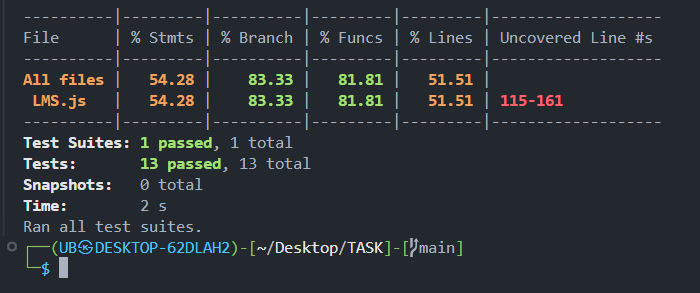

# Library Management TDD (Incubyte) Kata Solution

Welcome to my solution for the Library Management Kata! This repository showcases the use of Test-Driven Development (TDD) to solve a programming problem, emphasizing small, incremental commits and clear, concise code.

## Table of Contents

- [Problem Statement](#problem-statement)
- [Requirements](#requirements)
- [Solution](#solution)
- [Features](#features)
- [Setup Instructions](#setup-instructions)
  - [Prerequisites](#prerequisites)
  - [Clone the Repository](#clone-the-repository)
  - [Install Dependencies](#install-dependencies)
  - [Running Tests](#running-tests)
  - [Test Report](#test-report)
- [Test Coverage](#test-coverage)

## Problem Statement

Create a simple library management system that allows users to perform basic operations such as adding books, borrowing books, returning books, and viewing available books.

### Requirements

- **Add Books**:
  - Users should be able to add new books to the library.
  - Each book should have a unique identifier (e.g., ISBN), title, author, and publication year.

- **Borrow Books**:
  - Users should be able to borrow a book from the library.
  - The system should ensure that the book is available before allowing it to be borrowed.
  - If the book is not available, the system should raise an appropriate error.

- **Return Books**:
  - Users should be able to return a borrowed book.
  - The system should update the availability of the book accordingly.

- **View Available Books**:
  - Users should be able to view a list of all available books in the library.

For a detailed problem statement and requirements, [click here](Problem%20Statement.md).

## Solution

This project follows TDD principles to solve the kata problem. The solution is built with small, incremental commits, ensuring that each feature is developed and tested in isolation, demonstrating effective TDD practices.

## Features

### User Management

1. **addDetails()**

   - Description: A utility function that provides a command-line interface (CLI) for interacting with the library system. Users can choose to add books, borrow books, return books, view available books, or exit the system.
- Parameters: None.
- Returns: None. This function is intended for CLI interaction and runs indefinitely until the user chooses to exit.

### Book Management

1. **addBook(isbnNo, title, author, publishedYear)**

   - Description: Adds a new book to the library system.
 - Parameters:
    - isbnNo (number): The ISBN number of the book.
    - title (string): The title of the book.
    - author (string): The author of the book.
    - publishedYear (number): The year the book was published.
- Returns: A message indicating whether the book was successfully added or if there was an error (e.g., missing details or book already exists).

2. **viewAvailableBooks()**

   - Description: Displays all books that are currently available for borrowing in the library.
- Parameters: None.
- Returns: An array of book objects that are available for borrowing.
### Borrowing and Returning Books

 1. **borrowBook(isbnNotoBorrow)**
    - Description: Allows a user to borrow a book from the library.
- Parameters:
  - isbnNotoBorrow (number): The ISBN number of the book to borrow.
- Returns: A message indicating whether the book was successfully borrowed or if there was an error (e.g., invalid ISBN number, book already borrowed, book not found).
2. **returnBook(isbnNotoReturn)**
     - Description: Allows a user to return a previously borrowed book to the library.
- Parameters:
  - isbnNotoReturn (number): The ISBN number of the book to return.
 - Returns: A message indicating whether the book was successfully returned or if there was an error (e.g., invalid ISBN number, book not borrowed, book not found).
## Setup Instructions

### Prerequisites

- [Node.js](https://nodejs.org/): Ensure Version 14  or later is installed on your machine.
- [npm](https://www.npmjs.com/)(Node Package Manager): Ensure npm is installed for managing dependencies and building the project.

### Clone the Repository

1. Open your terminal or command prompt.
2. Run the following command to clone the repository:

    ```bash
    git clone https://github.com/Udaibhat123/LMS_Incubtye.git
    ```

3. Navigate into the project directory:

    ```bash
    cd TASK
    ```

### Install Dependencies

   ```bash
   npm install
   ```


### Running Tests


   ```bash
   npm test
   ```

   After running `npm test`, you will see the results of the test cases, including details on passed and failed tests.

 ### Test Report

   ```bash
   npm test -- --coverage
   ```

   This command will generate a test coverage report, showing the percentage of code covered by tests. It will include coverage details for statements, branches, functions, and lines.


## Test Coverage


 